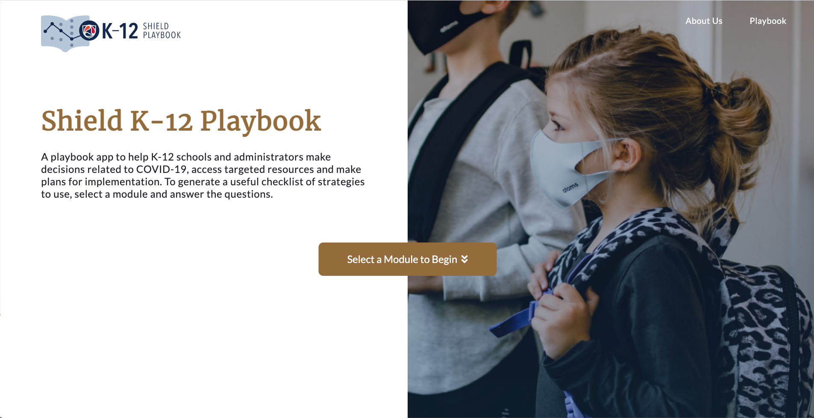

# SHIELD K-12 Playbook

visit https://shield-k12-playbook.ncsa.illinois.edu

--------
## How to Run

### For local development
- run`sh exec.sh`

### For deployment
#### Deploy with domain name and SSL
1. `ssh` into your remote machine
2. Make suer you already install `git`, `cron`, `docker`:
   - Following the instruction of https://docs.docker.com/engine/install/ubuntu/ to install docker. 
   - Install docker-compose following: https://docs.docker.com/compose/install/
3. `git clone` this repository `git clone https://github.com/ncsa/ShieldPK12.git`
4. Initialize SSL certificate by run `sh init-letsencrypt.sh`, please change the domain name to ones that you 
  own. Right now this domain is pointing towards `shield-k12-playbook.ncsa.illinois.edu`. Check [init-letsencrypt.
  sh](init-letsencrypt.sh) for more details.
5. To see if the whole stack comes together by running command `docker-compose up`
6. To shut down the running app, run command `docker-compose down`  
7. **Important note:** you can run cronjob to automatically redploy if there is any change on the code repository.
  To do so, follows the below steps:
    - Change which git branch to monitor by modifying the `BRANCH` variable in [redeploy.sh](redeploy.sh) script. 
      - E.g. point to the current branch: `BRANCH=$(git branch --show-current)`
      - E.g. point to the master branch `BRANCH=master`
    - Place `*/5 * * * * (cd /home/ubuntu/ShieldPK12 && sh redeploy.sh > redeploy.log)` into a text file, e.g. 
      `job.txt`
    - Then run command `crontab job.txt`. You can check if cronjob in place by `crontab -l`
  
#### Deploy without SSL
In case you do not own a domain name yet, or just want to deploy the test/develop version of the app, you can deploy 
without SSL: 
1. Follow **step 1 - 3** in previous section 
2. Run command `docker-compose -f docker-compose_wo_ssl.yml up --build -d`. 
3. Then you can access the web app at `http://{hostIP}`. See the custom docker compose file [docker-compose_wo_ssl.yml](docker-compose_wo_ssl.yml)
for more details. 
   
---------
   
## Tutorials and Useful Links
#### [How to add new modules](https://github.com/ncsa/ShieldPK12/wiki/How-to-add-new-modules)
#### [Code repository structure](https://github.com/ncsa/ShieldPK12/wiki/Code-Repository-Structure-Explanation)
#### [Presentations and citations](https://github.com/ncsa/ShieldPK12/wiki/Presentations-and-citation)
#### [Docker and docker compose explained](https://github.com/ncsa/ShieldPK12/wiki/Use-docker-and-docker-compose-to-start-the-app)
#### [the Module Class](https://github.com/ncsa/ShieldPK12/wiki/Logics-to-go-to-%22Next%22-Q&A-explained)
#### [Guideline of content creation](https://github.com/ncsa/ShieldPK12/wiki/How-to-create-content-for-a-new-module)