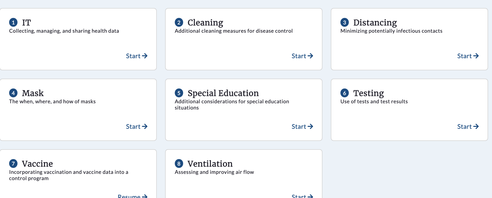

# SHIELD K to 12 Playbook

## How to Run

### For local development
- run`sh exec.sh`

### For deployment
#### Deploy with ssl
- `ssh` into your remote machine
- Make suer you already install `git`, `cron`, `docker`: 
  - Following the instruction of https://docs.docker.com/engine/install/ubuntu/ to install docker.
  - Install docker-compose following: https://docs.docker.com/compose/install/
- `git clone` this repository `git clone https://github.com/longshuicy/ShieldPK12.git`
- Initialize SSL certificate by run `sh init-letsencrypt.sh`, please change the domain name to ones that you 
  own. Right now this domain is pointing towards `shield-k12-playbook.ncsa.illinois.edu`. Check [init-letsencrypt.
  sh](init-letsencrypt.sh) for more details.
- To see if the whole stack comes together by running command `docker-compose up`
- To shut down the running app, run command `docker-compose down`  
- **Important note:** you can run cronjob to automatically redploy if there is any change on the code repository. 
  To do so, follows the below steps:
    - Change which git branch to monitor by modifying the `BRANCH` variable in [redeploy.sh](redeploy.sh) script. 
      - E.g. point to the current branch: `BRANCH=$(git branch --show-current)`
      - E.g. point to the master branch `BRANCH=master`
    - Place `*/5 * * * * (cd /home/ubuntu/ShieldPK12 && sh redeploy.sh > redeploy.log)` into a text file, e.g. 
      `job.txt`
    - Then run command `crontab job.txt`. You can check if cronjob in place by `crontab -l`
  
#### Deploy without SSL
In case you do not own a domain name yet, or just want to deploy a test/develop version of the app, you can deploy 
without SSL: Run command `docker-compose -f docker-compose_wo_ssl.yml up --build -d`. Then you can access the 
web app at `http://{hostIP}`. See the custom docker compose file [docker-compose_wo_ssl.yml](docker-compose_wo_ssl.yml)
for more details.

## How to add new module

### Write a new module
#### Format explanation
Modules are written in JSON (JavaScript Object Notation) format, which is a lightweight data-interchange format. It is 
easy for humans to read and write. It is easy for machines to parse and generate. [Read more...](https://www.json.org/json-en.html)

We define a few fields that this playbook app recognizes and automatically populates. If you would need to add content 
beyond the predefined fields, you would also need to modify the existing app code, or add additional code to parse and 
render those.

Here is an example of the module template. You can also find the same content here [decision_template.json](test/decision_template.json). 
You can also see how other modules were written under the [decisiontrees](decisiontrees) folder.
```angular2html
{
  "moduleName": "",
  "moduleDescription": "",
  "prettyModuleName": "",
  "moduleContent": [
    {
      "rules": {
        "operator": "AND",
        "criteria": [
          {
            "AID": ""
          }
        ]
      },
      "QID": "",
      "question": "",
      "description": "",
      "answers": [
        {
          "AID": "",
          "prettyAID": "",
          "answer": "",
          "description": "",
          "nextQID": ""
        },
        ...,
        ...
      ]
    },
    ...
  ],
  "checklist": [
    {
      "activityID": "",
      "activity": "",
      "links": [],
      "rules": {
        "operator": "OR|AND|NOT|ALL",
        "criteria": [
          {
            "AID": ""
          },
          ...
        ]
      }
    },
    ...
  ]
}
```

- **moduleName** will reflect on the URL of that module. No space is allowed on this field. For example, 
  `"moduleName": "cleaning"` will place the cleaning module under `/cleaning/questions`
- **prettyModuleName** is the pretty name for a module where space and other special characters are allowed. 
- **moduleDescription**: a short paragraph of module description will be reflected on the module cards located 
  at the landing page. 
--------------------------------  
- **moduleContent** contains a list of Q&A items. Each item is one screen:  
```angular2html
{
      "QID": "",
      "question": "",
      "description": "",
      "answers": [
        ...
        ...
        ...
      ]
    },
```
- **QID** is the unique question id
- **question** will be displayed on the left of the screen
- **description**: short description of the question will be displayed below the question. HTML tag is allowed, e.g.
  `<a>` tag for links
- **answers**: contains a list of options as answers of the question:
```angular2html
    "answers": [
        {
          "AID": "",
          "prettyAID": "",
          "answer": "",
          "description": "",
          "nextQID": ""
        },
        ...
    ]
```
- **AID** is the unique answer id
- **prettyAID** is the prettified answer id (usually we use "a, b, c, ...", but you could use "1, 2, 3, ...", or "i,
  ii, iii,..")
- **answer** is the content of answer that will be displayed on the right of the screen as selectable options
- **description*** is the description of the answer 
- **nextQID** is the id of the next question that you want to point user toward upon selection. It is very 
  important that you put down the correct and existing QID, otherwise it may cause malfunction of the app. If you 
  reach the end of your module (last question), then simply put `null` as the nextQID.

The skip/display for some of the questions may depend on previous answers. 

For example: Only when use answer "surface cleaning supplies" for the question "What supplies will you have for 
cleaning", they will be prompted to answer "What surface cleaning supplies will you have". You can use the **rules** field to set up those conditions:
```angular2html

      "rules": {
        "operator": "AND",
        "criteria": [
          {
            "AID": ""
          }
        ]
      },
```
- **operator**: You can put down `OR`, `AND`, or `NOT`. This is the logic operator to determine if *any*, *all*, or 
  *none* of the criteria need to be matched in order to display this Q&A.
- **criteria**: a list of answer IDs to match
- **AID**: valid, existing answer id

To help you understand, here is an example in [cleaning module](decisiontrees/cleaning_decision.json):
```angular2html
{
      "QID": "2",
      "question": "What supplies will you have for cleaning",
      "multiple": true,
      "description": "Cleaning resources should...",
      "resources": [],
      "answers": [
        {
          "AID": "2a",
          "prettyAID": "a",
          "answer": "Surface cleaning supplies",
          "description": "",
          "resources": [],
          "nextQID": "2a-i"
        },
        {
          "AID": "2b",
          "prettyAID": "b",
          "answer": "Air Filters",
          "description": "See the <a href='/ventilation/questions'>ventilation...",
          "resources": [],
          "nextQID": "3"
        }
      ]
    },
```

If a user chooses `AID = 2a` as the answer, the following Q&A screen will be displayed:
```angular2html
{
      "QID": "2a-i",
      "question": "What surface cleaning supplies will you have",
      "multiple": true,
      "rules": {
        "operator": "AND",
        "criteria": [
          {
            "AID": "2a"
          }
        ]
      },
      "description": "",
      "resources": [],
      "answers": [
        ...
        ...
      ]
    },
```
Otherwise, this question "2a-i" will be skipped.

--------------------------------  
## Decision Tree Structure
### Cleaning Decision


### Distancing Decision


### IT Decision
- TBD

### Mask Decision


### Testing Decision


### Ventilation Decision
